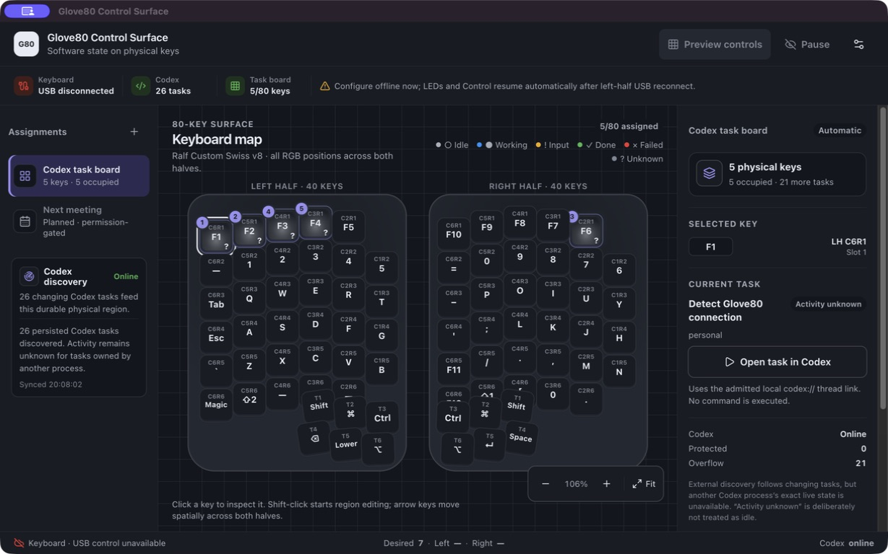
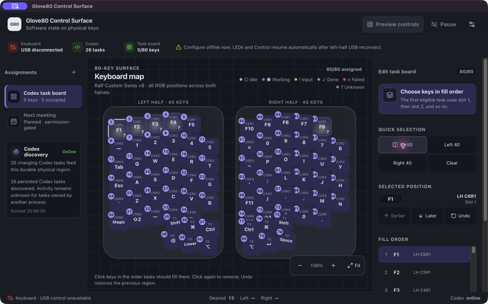

# Glove80 Control Surface

Bind Glove80 keys to desktop integrations, actions, live states, colors, and
animations.

Glove80 Control Surface is an open-source project for turning a MoErgo Glove80
into a software control surface without giving up its normal keyboard layout.
Desktop integrations can attach live state and actions to physical keys.

> [!IMPORTANT]
> The current keyboard runs alpha6: Swiss v8 typing and the complete left-side
> USB protocol are hardware-proven, but its right-side scene transfer repeatedly
> aborts before rendering. The repository contains a reproducible, unflashed
> alpha7 correction and matching recovery pair. Alpha7 still requires explicit
> approval for each half and a grouped post-flash hardware gate.

## The idea

The product has two independent planes:

- **Ambient display:** selected keys can show live status while the keyboard is
  being used normally.
- **Explicit interaction:** hold the printed ↑ key for primary actions or the
  printed ↓ key for secondary actions. The generated Control layer is active
  only for the duration of that hold.

The held modifier and currently available action keys light immediately in
firmware; pressed actions brighten without a host round trip. Releasing the
modifier or losing the desktop lease exits Control. With no live session, ↑
and ↓ retain their original `KP_DOT` and `KP_N0` bindings. The first held
modifier wins when both are pressed.

The first product has two integrations:

- **Codex:** the user chooses a task-board region once; current tasks are
  allocated stably across its keys and show idle, working, completed/unread,
  needs-input, or failed state.
- **Calendar:** a key represents the next qualifying meeting from calendars
  selected by the user and becomes more prominent as the meeting approaches.

None of those concepts belong in the firmware. They are host-side integrations
using a generic control-surface protocol.



This is the signed packaged application using the real Codex app-server on this
Mac. The keyboard was intentionally disconnected during this capture, so the
UI keeps all 80 positions editable while honestly withholding USB controls.
Native HID remains isolated in the Electron main process; the renderer never
receives a device handle.



## Product model

```text
Glove80 firmware
  ├── renders a leased scene across both 40-key halves
  ├── runs solid and pulse locally
  └── emits banked key down/up events in a leased Control layer

One cross-platform desktop application
  ├── owns the USB HID session in its Electron main process
  ├── stores bindings for every available RGB cell
  ├── runs built-in integrations
  ├── resolves semantic state into accessible visuals
  └── shows a labeled HUD while a primary or secondary bank is held
```

See [Product model](docs/product.md), [Architecture](docs/architecture.md),
[User experience](docs/user-experience.md), and
[Desktop application plan](docs/application.md). The internal semantic boundary
is detailed in [Integration model](docs/integrations.md). The two initial
experiences are specified in [Codex integration UX](docs/integration-codex.md)
and [Calendar integration UX](docs/integration-calendar.md).

## Principles

1. **Normal typing is inviolable.** A crash or disconnect must not strand the
   keyboard in a control mode.
2. **Display and interaction are separate.** Status may remain glanceable while
   typing; only an explicit ↑ or ↓ hold changes what other keys mean.
3. **Firmware is generic.** It understands cells, events, scenes, effects, and
   sessions—not calendars, task systems, or individual applications.
4. **Bindings are dynamic.** Assigning an integration to a key must not require
   reflashing firmware.
5. **Animations run on the keyboard.** The host sends semantic effects instead
   of streaming RGB frames.
6. **Integrate narrowly.** Existing MoErgo/ZMK configuration remains the source
   of truth; arbitrary keymap source rewriting is not an initial promise.
7. **Flashing is explicit.** Builds are pinned and hashed, and recovery uses a
   previously saved or reproducibly rebuilt known-good artifact.
8. **No arbitrary remote ZMK execution.** The host cannot invoke reset,
   bootloader, bond deletion, or unrestricted firmware behaviors.

## Initial target

- MoErgo Glove80 with RGB
- macOS, Windows, and Linux, with macOS receiving the most platform polish
- USB transport first
- all 80 RGB cells across both halves as the product target
- one Electron desktop application with a state-owning TypeScript main process
- Codex first; Calendar ships only if its small evidence gate passes
- solid and pulse; blink is accepted only if later accessibility and power
  evidence justify it
- a labeled on-screen HUD during interaction when the app window is open

Firmware work expanded in measured steps: the existing six-cell experiment
remains a regression fixture, then complete 40-cell left scenes and
synchronized 40-cell right scenes were implemented. Alpha6 proved the complete
left path but exposed an undersized bounded BLE transfer window on the right.
Alpha7 corrects that bound while retaining a separate lease-expiry reserve; it
is not a release until the grouped physical acceptance gate passes.
Bluetooth, a public plugin SDK, and a generic Calendar-provider layer remain
separate evidence-gated expansions.

## Repository status

The repository now contains an Electron/React desktop application wired to the
real generic HID device, a supervised read-only Codex task source, a
state-owning TypeScript control core, a complete 80-cell position editor,
leased-session firmware and recovery builds, atomic persistence, conformance
fixtures, and the specifications that govern each milestone. Alpha7 is
offline-verified but still requires explicit per-half flash approval and the
grouped physical acceptance matrix.

- [Executable milestones](MILESTONES.md)
- [Roadmap](docs/roadmap.md)
- [End-to-end user experience](docs/user-experience.md)
- [Desktop application and visual editor](docs/application.md)
- [Future-user needs](docs/user-needs.md)
- [Open design questions](docs/open-questions.md)
- [Firmware boundary](docs/firmware.md)
- [Milestone 4 desktop integration review](docs/reviews/milestone-4-desktop-integration.md)
- [Alpha5 pre-flash gate](docs/reviews/milestone-4-preflash-gate.md)
- [Safety model](docs/safety.md)
- [ZMK command inventory](docs/research/zmk-command-inventory.md)
- [Architecture decisions](docs/decisions/)

## Contributing

Discussion, hardware observations, protocol review, and implementation
proposals are welcome. Read [CONTRIBUTING.md](CONTRIBUTING.md) before opening a
pull request. Security-sensitive findings should follow [SECURITY.md](SECURITY.md).

## Project status and trademarks

Glove80 Control Surface is an independent, unofficial community project. It is
not affiliated with, endorsed by, or supported by MoErgo. Glove80 and MoErgo
are trademarks of their respective owners.

## License

[MIT License](LICENSE)
