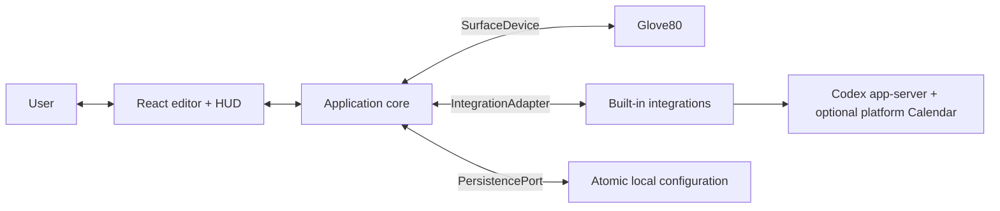

# Desktop application plan

## Product role

The desktop application is the only component that understands both sides of
the product:

```text
integration semantic state
    ↕
application bindings and scene composition
    ↕
keyboard cells, scenes, and physical events
```

It does not forward either side's native API to the other. Integrations never
receive HID access, and the keyboard never receives integration identifiers,
credentials, or application-specific commands.

## Initial boundaries

The first application talks to three kinds of dependency:



Firmware building and flashing are an explicit separate workflow. The running
application does not talk to bootloaders, Bluetooth pairing settings, or the
right half directly.

## One-application architecture

The initial product is one Electron application with a state-owning TypeScript
main process and a React renderer. Logical boundaries are plain TypeScript
modules/packages and React components, not services:

```text
App
├── Core
│   ├── AppCoordinator
│   ├── AppState
│   ├── BindingStore
│   ├── SlotAllocator
│   ├── SceneComposer
│   └── ActionDispatcher
├── Device
│   ├── SurfaceDevice
│   └── Glove80SurfaceDevice
├── Integrations
│   ├── IntegrationAdapter
│   ├── IntegrationRegistry
│   ├── CodexAdapter
│   └── CalendarAdapter
├── Persistence
│   └── ConfigurationFile
└── UI
    ├── KeyboardEditor
    ├── BindingInspector
    ├── IntegrationBrowser
    ├── IntegrationSourceEditors
    ├── InteractionHUD
    └── MenuBarStatus
```

These are organizational boundaries inside one application target. The two
small workspace packages are limited to hardware-neutral protocol and core
state logic. Use direct construction and small test fakes; do not add a
dependency-injection framework, event broker, local RPC server, daemon, worker
process, or public plugin loader.

Milestone 2 follows that rule directly: three plain Electron-main modules
supervise Codex, decode its narrow protocol subset, and publish semantic tasks
through the existing core API. The only renderer addition is a push
subscription for fresh immutable view state.

`AppCoordinator` is the single writer for runtime application state. Device
events, integration events, UI commands, and persistence results are serialized
through it. The UI observes derived immutable view state. It coordinates
rather than containing domain logic: binding resolution and scene composition
remain pure.

One application does not mean one OS process or one executor. Electron uses a
main process, a sandboxed renderer, and supporting Chromium processes. The
main process owns state and side effects. HID work stays asynchronous and may
move to an Electron utility process only if measurement shows main-process
latency can miss a lease. Each integration owns cancellable, timeout-bounded
observation work. Slow UI or network work must never block a keyboard lease.
Event streams are bounded and report overflow explicitly.

## Core data model

The minimum durable nouns are:

```text
CellID
IntegrationID
SourceConfiguration
Binding
PresentationOverride
Acknowledgement
AppPreferences
```

A Codex board binding is:

```json
{
  "cells": [12, 13, 14, 15, 52, 53],
  "integration": "codex",
  "source": {"kind": "taskBoard", "strategy": "priority"},
  "action": "openTask",
  "visibility": "always",
  "presentationOverride": null
}
```

Runtime state is separate and never written on every poll:

```text
ResolvedCollection
AllocationCandidate
SlotAllocation
DeviceSnapshot
ResolvedCellPresentation
SceneGeneration
InteractionEpoch
ActionInvocation
```

`SourceConfiguration` is an opaque, integration-owned selector. The core never
interprets Codex candidate rules or a Calendar query. `taskBoard` deliberately
resolves to several resources; `nextMeeting` resolves to zero or one.

`ResolvedCollection` contains availability, observation time, expiry, and zero
or more tiles. Each tile contains a resource identity, semantic state, action
availability, retention hint, and revision. `SlotAllocation` is the host-owned
stable mapping from tiles to the binding's ordered cells. Runtime resolution
and allocation are not rewritten into the durable binding.

Bindings, preferences, acknowledgement state, and sticky allocation hints are
stored in one versioned JSON document using atomic replacement.
Neither v0 integration stores a service credential. A database or credential
port is added only if a measured need appears.

## Adapter contracts

### SurfaceDevice

The core sees one logical keyboard, not USB/BLE or two halves:

```text
connect() → DeviceCapabilities
disconnect()
setDesiredScene(scene) → AppliedScene
pause()
events() → stream of DeviceEvent
```

`Glove80SurfaceDevice` alone maps that port onto `GET_CAPABILITIES`,
`GET_STATUS`, `OPEN_SESSION`, `RENEW_SESSION`, `SCENE_FRAGMENT`, and
`CLOSE_SESSION`. It owns report encoding, device matching, sequence numbers,
coalescing, fragmentation, checksums, retries, leases, reconnect/full resend,
event validation, and central/right acknowledgements. A simulated device
implements the same port for development and tests.

The core sends complete desired scenes and receives generic cell events. It
never calls ZMK behaviors.

Desired and applied scenes are separate state. The canvas previews desired
state, but synchronization UI reports what the device has acknowledged. A
rejected scene, stale right generation, or absent peripheral must never be
shown as fully applied.

### IntegrationAdapter

The first adapters are trusted, compiled-in implementations:

```text
descriptor
connect(configuration)
disconnect()
validate(source configuration) → validated source configuration
observe(binding IDs + source configurations) → async stream of resolved collections
perform(action request) → action result
```

The contract uses:

```text
SourceConfiguration
ResolvedResource
ResolvedCollection
AllocationCandidate
Retention
ActionDescriptor
ActionRequest
ActionResult
IntegrationAvailability
```

The runtime adapter receives binding IDs plus opaque source configurations, not
cells, actions, visibility, or presentation. Its async stream may combine
provider events and bounded refresh timers.

A separate built-in `IntegrationSourceEditor` in the UI edits that
integration's source configuration. A Codex task-board region/source editor
and Calendar-set selector are materially different UI. The application
provides the common inspector shell; it does not invent a generic form schema
or make the runtime adapter own views.

Resolved collections include observation time and expiry; tiles include a
revision so stale or out-of-order updates can be rejected. An empty collection
leaves its cells unallocated and actionless.

An adapter may suggest accessible default presentations for semantic state IDs,
but it cannot set cells, scene priority, global brightness, or HID data.

Every action request has an invocation ID. Adapters must return accepted,
completed, cancelled, or failed without silently retrying a non-idempotent
action.

Action availability has an independent `enabled` value and explanation. It is
not inferred from color or semantic state. During interaction, the coordinator
passes the frozen resource identity and observed revision to the adapter. The
adapter requires the same resource identity and current action validity before
acting; an unrelated revision change alone does not reject a safe open action.

Adapters receive only the narrow services they need, such as redacted logging,
clock, and URL opening. They do not receive the application store or
`SurfaceDevice`.

### UI commands

The UI sends user intentions to `AppCoordinator`:

```text
selectCells
setBinding
removeBinding
previewCell
setPresentation
connectIntegration
disconnectIntegration
pauseSurface
resumeSurface
invokeBinding
acknowledgeBinding
```

It observes one `AppViewState` containing keyboard geometry, cell display
models, selection, integration availability, action feedback, connection
status, and errors. The UI never opens HID, calls an external service, or
writes configuration directly.

## Visual editor

The editor deliberately uses the successful spatial mental model of MoErgo's
official Layout Editor: the keyboard is the primary canvas, a key is selected
directly, scope navigation sits on the left, a contextual inspector sits on the
right, and pan/zoom/fit controls preserve the physical geometry.

It is not a replacement layout editor. There are no ZMK layers, keycode
pickers, macros, or firmware build controls in the runtime workspace.

```text
┌──────────────────────────────────────────────────────────────────────────┐
│ Glove80 Control Surface   ● Connected · USB   Both halves synced  Pause │
├──────────────┬─────────────────────────────────────────┬─────────────────┤
│ Integrations │                                         │ Selected: LH 1  │
│              │          physical Glove80 canvas        │                 │
│ ● Codex      │                                         │ Codex           │
│ ○ Calendar   │      [left 40]        [right 40]        │ Task: Release   │
│              │                                         │ Open task       │
│              │   key legends + live RGB previews       │                 │
│              │                                         │ Working: blue   │
│              │                          − 100% +  Fit   │ Done: green     │
├──────────────┴─────────────────────────────────────────┴─────────────────┤
│ Scene 42 applied · Left 42 · Right 42 · batteries 96% / 91%             │
└──────────────────────────────────────────────────────────────────────────┘
```

### Canvas behavior

- Render the real two-half geometry from a versioned device catalog.
- Preserve the user's ordinary key legend as the primary label.
- Show integration identity as a small badge, not a replacement legend.
- Preview the resolved live RGB color/effect on each cell.
- Use an outline for selection so selection is not conveyed by color alone.
- Click selects one key and opens its inspector.
- Shift-click adds or removes keys from an ordered region; the order is visible
  and editable in the inspector.
- Double-click focuses the first editable inspector control.
- Selecting a cell in software sends a temporary identify preview.
- Pressing a cell while the physical interaction trigger is held selects the
  same cell when explicit editor capture mode is active. Capture consumes the
  app event as selection and never dispatches the binding's action.
- Provide zoom, fit, keyboard navigation, and an accessible non-spatial binding
  list.

Firmware topology does not contain the user's current legends. The editor may
optionally import the user's MoErgo layout JSON read-only to display base-layer
legends. Imported legends are timestamped, replaceable display metadata keyed
by stable cell ID. The application never rewrites, uploads, builds, or flashes
that configuration.

Lasso, drag-to-copy, pages, and arbitrary key rearrangement are deferred.
Ordered multi-selection is required for the Codex task board; a one-cell
selection remains the Calendar flow.

### Left assignment rail

The left rail shows durable physical meanings: **Codex task board** and, if its
evidence gate passes, **Next meeting**. Selecting an assignment highlights its
physical region and runtime allocation. Connections and adapter health live in
setup/settings rather than becoming the user's daily navigation. `+ Add`
offers only the built-in assignment types; it does not resemble a plugin
marketplace.

### Right binding inspector

The inspector follows a short top-to-bottom decision sequence:

```text
Assignment
Represents
When pressed
Visibility
Appearance
```

The assignment embeds a small integration-specific editor:

- Codex selects an ordered region of any size. The board fills automatically;
  workspace restriction is optional and runtime task identity is read-only.
- Calendar selects `next meeting`, one or more calendars, and eligibility
  options.

The default presentation is shown before overrides. Advanced palette/effect
controls remain collapsed. Saving is immediate and local, with Undo for
binding edits.

Configuration has three visible scopes:

| Scope | Examples |
| --- | --- |
| Application | brightness, pause, palette, reduced motion, no flash, privacy, launch at login |
| Integration | Codex connection; Calendar permission and available calendars |
| Surface binding | ordered cells, source selector, one action, visibility, optional appearance override |

The interaction trigger is not a runtime setting in v0. It is installed in the
generated ZMK integration seam. The app displays and teaches the installed
trigger but does not claim it can move it without rebuilding firmware.

### Top and bottom status

The top bar answers the user questions that matter continuously:

```text
Is the keyboard connected?
Is the surface active or paused?
Are both halves synchronized?
```

The bottom status bar provides generation, transport, battery, stale, and error
details without placing firmware terminology in the main workflow.

### Interaction HUD

Holding the physical trigger presents a compact, non-activating overlay near
the current display edge. It shows only bound keys, their resource labels, live
state, and action. It must not steal keyboard focus.

The HUD is a hypothesis to user-test. The physical LEDs remain useful without
it, and critical needs-input/error state also has an accessible textual path.

## State flows

### Integration state to keyboard

```text
adapter emits resolved collection
→ coordinator updates runtime binding state
→ slot allocator preserves or updates resource-to-cell assignments
→ scene composer resolves binding + user presentation
→ short coalescing window
→ surface device accepts a new desired scene
→ its HID task stages and commits the generation
→ central and right acknowledgements update applied state
```

The slot allocator and scene composer are pure functions. They receive
capabilities, bindings, resolved collections, previous allocations,
preferences, and current frozen resolutions and return stable allocations plus
one complete desired scene. The device adapter handles byte encoding.

### Physical action to integration

```text
keyboard emits MODE_ENTER(epoch, generation)
→ coordinator freezes complete allocation, identities, and observed revisions
→ keyboard emits KEY_DOWN(epoch, cell)
→ action dispatcher resolves frozen binding
→ adapter revalidates frozen resource identity and current action availability
→ adapter performs action with invocation ID
→ result updates HUD and action feedback
→ MODE_EXIT releases frozen resolution
```

Gaps in device event sequence cancel active gestures. They never trigger
speculative action retries.

### Pause and failure

Pausing closes the device session and clears the temporary scene. Integration
observation may continue so resuming can immediately render current state.

On application crash, disconnect, or lease expiry, firmware clears the scene
and exits interaction. On restart, the application loads durable configuration,
reconnects integrations, opens a new session, reads device status, and sends a
complete scene.

## Recommended implementation stack

Use:

- Electron for the cross-platform application shell, windows, tray, and
  packaging;
- TypeScript in Electron main for coordination, `node-hid`, leases, atomic
  persistence, platform seams, and supervised Codex app-server stdio;
- React, TypeScript, and Vite for the sandboxed keyboard editor and HUD;
- a versioned JSON configuration document;
- Vitest/Testing Library, deterministic fake adapters, packaged-app smoke
  tests, and browser screenshot flows.

The renderer is sandboxed with context isolation and cannot spawn processes or
open HID. The preload exposes an explicit allowlist of semantic operations.
GUI applications do not reliably inherit an interactive shell `PATH`, so Codex
executable discovery is explicit. macOS distribution is non-App-Store and
code-signed/notarized. Linux documents a narrowly scoped udev rule and degrades
the no-focus HUD honestly where Wayland prevents exact placement.

## Testing strategy

### Pure and deterministic

- Binding and configuration migrations.
- Semantic-state-to-presentation resolution.
- Complete-scene composition for 0, 6, 40, and 80 cells.
- Sticky collection allocation, overflow, eviction, and freeze by interaction
  epoch.
- Action dispatch deduplication.
- Session/reconnect reducer transitions.

### Adapter contracts

- One fake keyboard runs the same capability, acknowledgement, timeout,
  reconnect, and event-overflow scenarios as hardware.
- Every integration adapter passes shared source validation, observation,
  resource-identity freeze, revision ordering, state expiry, cancellation,
  diagnostic-redaction, and action-result tests.
- HID golden vectors are shared with firmware tests.

### UI

- Component and domain tests for both-half geometry, selection,
  bound/unbound, stale, paused, incompatible, and accessible themes.
- Keyboard-only and VoiceOver navigation.
- Reduced-motion, no-flash, high-contrast, and increased-text settings.
- Checked-in compact and large light/dark screenshots with a human visual
  review; browser-harness state flows must also pass the native conformance
  fixtures.

### Hardware

- Six-cell regression fixture first.
- Complete left and right generation acknowledgement.
- Sleep/wake, cable removal, application termination, and right-half reconnect.
- No flash or configuration change from runtime application tests.

## Delivery plan

The canonical implementation order, status, evidence gates, and acceptance
commands live in [Delivery milestones](../MILESTONES.md). This document defines
component responsibilities and does not maintain a second checklist.

## Explicitly deferred

- Downloadable third-party plugins and a marketplace.
- Plugin subprocesses, sandbox protocol, permissions UI, and signing.
- A daemon, local RPC server, or multiple UI clients.
- A separately installed renderer or helper service.
- Automatic firmware building or flashing.
- Bluetooth pairing management.
- Multiple pages and profiles.
- Provider abstractions invented solely to make Calendar appear cross-platform.
- Cloud synchronization and accounts.
- Telemetry.

## Primary visual references

- [MoErgo Layout Editor](https://my.moergo.com/glove80/)
- [MoErgo Layout Editor workspace and page structure](https://docs.moergo.com/layout-editor-guide/layout-editing/)
- [OpenAI Codex Micro](https://openai.com/supply/co-lab/work-louder/)
- [OpenAI Codex Micro guide](https://learn.chatgpt.com/docs/features/codex-micro)

The project follows the editor's spatial interaction model, not its branding,
code, or firmware-layout responsibilities.
