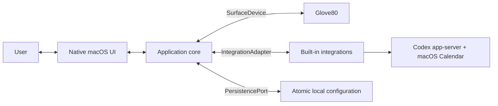

# Desktop application plan

## Product role

The desktop application is the only component that understands both sides of
the product:

```text
integration semantic state
    ↕
application bindings and scene composition
    ↕
keyboard cells, scenes, and physical events
```

It does not forward either side's native API to the other. Integrations never
receive HID access, and the keyboard never receives integration identifiers,
credentials, or application-specific commands.

## Initial boundaries

The first application talks to three kinds of dependency:



Firmware building and flashing are an explicit separate workflow. The running
application does not talk to bootloaders, Bluetooth pairing settings, or the
right half directly.

## One-process architecture

The initial product is one native macOS application. Logical boundaries are
plain protocols and folders, not services:

```text
App
├── Core
│   ├── AppCoordinator
│   ├── AppState
│   ├── BindingStore
│   ├── SceneComposer
│   └── ActionDispatcher
├── Device
│   ├── SurfaceDevice
│   └── Glove80SurfaceDevice
├── Integrations
│   ├── IntegrationAdapter
│   ├── IntegrationRegistry
│   ├── CodexAdapter
│   └── CalendarAdapter
├── Persistence
│   └── ConfigurationFile
└── UI
    ├── KeyboardEditor
    ├── BindingInspector
    ├── IntegrationBrowser
    ├── IntegrationSourceEditors
    ├── InteractionHUD
    └── MenuBarStatus
```

These are organizational boundaries inside one application target, not a
collection of packages. Use initializer injection and small test fakes; do not
add a dependency-injection framework, event broker, local RPC server, daemon,
worker process, or public plugin loader.

`AppCoordinator` is the single writer for runtime application state. Device
events, integration events, UI commands, and persistence results are serialized
through it. The UI observes derived immutable view state. It coordinates
rather than containing domain logic: binding resolution and scene composition
remain pure.

One process does not mean one executor. The device adapter owns an independent
actor/task for lease renewal and HID I/O; each integration owns cancellable,
timeout-bounded observation work. Slow UI or network work must never block a
keyboard lease. Event streams are bounded and report overflow explicitly.

## Core data model

The minimum durable nouns are:

```text
CellID
IntegrationID
SourceConfiguration
Binding
PresentationOverride
Acknowledgement
AppPreferences
```

A fixed binding is:

```json
{
  "cell": 12,
  "integration": "codex",
  "source": {"kind": "fixedTask", "threadId": "thread-123"},
  "action": "openTask",
  "visibility": "always",
  "presentationOverride": null
}
```

Runtime state is separate and never written on every poll:

```text
ResolvedTile
DeviceSnapshot
ResolvedCellPresentation
SceneGeneration
InteractionEpoch
ActionInvocation
```

`SourceConfiguration` is an opaque, integration-owned selector. The core never
interprets a Codex thread ID or Calendar query. A removed fixed task makes its
binding stale; it is never silently remapped. A dynamic selector such as
`nextMeeting` deliberately resolves to a current resource.

`ResolvedTile` contains the currently represented resource, semantic state,
availability, action availability, revision, observation time, and expiry.
Resolution is runtime state and is not rewritten into the durable binding.

Bindings, preferences, acknowledgement state, and later dynamic-slot
allocation are stored in one versioned JSON document using atomic replacement.
Neither v0 integration stores a service credential. A database or credential
port is added only if a measured need appears.

## Adapter contracts

### SurfaceDevice

The core sees one logical keyboard, not USB/BLE or two halves:

```text
connect() → DeviceCapabilities
disconnect()
setDesiredScene(scene) → AppliedScene
pause()
events() → stream of DeviceEvent
```

`Glove80SurfaceDevice` alone maps that port onto `GET_CAPABILITIES`,
`GET_STATUS`, `OPEN_SESSION`, `RENEW_SESSION`, `SCENE_FRAGMENT`, and
`CLOSE_SESSION`. It owns report encoding, device matching, sequence numbers,
coalescing, fragmentation, checksums, retries, leases, reconnect/full resend,
event validation, and central/right acknowledgements. A simulated device
implements the same port for development and tests.

The core sends complete desired scenes and receives generic cell events. It
never calls ZMK behaviors.

Desired and applied scenes are separate state. The canvas previews desired
state, but synchronization UI reports what the device has acknowledged. A
rejected scene, stale right generation, or absent peripheral must never be
shown as fully applied.

### IntegrationAdapter

The first adapters are trusted, compiled-in implementations:

```text
descriptor
connect(configuration)
disconnect()
validate(source configuration) → validated source configuration
observe(binding IDs + source configurations) → async stream of resolved tiles
perform(action request) → action result
```

The contract uses:

```text
SourceConfiguration
ResolvedResource
ResolvedTile
ActionDescriptor
ActionRequest
ActionResult
IntegrationAvailability
```

The runtime adapter receives binding IDs plus opaque source configurations, not
cells, actions, visibility, or presentation. Its async stream may combine
provider events and bounded refresh timers.

A separate built-in `IntegrationSourceEditor` in the UI edits that
integration's source configuration. A Codex task picker and Calendar-set
selector are materially different UI. The application provides the common
inspector shell; it does not invent a generic form schema or make the runtime
adapter own views.

Resolved tiles include a revision, observation time, and expiry so stale or
out-of-order updates can be rejected. The resolved resource may be null, as
with a Calendar binding that currently has no eligible meeting.

An adapter may suggest accessible default presentations for semantic state IDs,
but it cannot set cells, scene priority, global brightness, or HID data.

Every action request has an invocation ID. Adapters must return accepted,
completed, cancelled, or failed without silently retrying a non-idempotent
action.

Action availability has an independent `enabled` value and explanation. It is
not inferred from color or semantic state. During interaction, the coordinator
passes the frozen resource identity and observed revision to the adapter. The
adapter requires the same resource identity and current action validity before
acting; an unrelated revision change alone does not reject a safe open action.

Adapters receive only the narrow services they need, such as redacted logging,
clock, and URL opening. They do not receive the application store or
`SurfaceDevice`.

### UI commands

The UI sends user intentions to `AppCoordinator`:

```text
selectCell
setBinding
removeBinding
previewCell
setPresentation
connectIntegration
disconnectIntegration
pauseSurface
resumeSurface
invokeBinding
acknowledgeBinding
```

It observes one `AppViewState` containing keyboard geometry, cell display
models, selection, integration availability, action feedback, connection
status, and errors. The UI never opens HID, calls an external service, or
writes configuration directly.

## Visual editor

The editor deliberately uses the successful spatial mental model of MoErgo's
official Layout Editor: the keyboard is the primary canvas, a key is selected
directly, scope navigation sits on the left, a contextual inspector sits on the
right, and pan/zoom/fit controls preserve the physical geometry.

It is not a replacement layout editor. There are no ZMK layers, keycode
pickers, macros, or firmware build controls in the runtime workspace.

```text
┌──────────────────────────────────────────────────────────────────────────┐
│ Glove80 Control Surface   ● Connected · USB   Both halves synced  Pause │
├──────────────┬─────────────────────────────────────────┬─────────────────┤
│ Integrations │                                         │ Selected: LH 1  │
│              │          physical Glove80 canvas        │                 │
│ ● Codex      │                                         │ Codex           │
│ ○ Calendar   │      [left 40]        [right 40]        │ Task: Release   │
│              │                                         │ Open task       │
│              │   key legends + live RGB previews       │                 │
│              │                                         │ Working: blue   │
│              │                          − 100% +  Fit   │ Done: green     │
├──────────────┴─────────────────────────────────────────┴─────────────────┤
│ Scene 42 applied · Left 42 · Right 42 · batteries 96% / 91%             │
└──────────────────────────────────────────────────────────────────────────┘
```

### Canvas behavior

- Render the real two-half geometry from a versioned device catalog.
- Preserve the user's ordinary key legend as the primary label.
- Show integration identity as a small badge, not a replacement legend.
- Preview the resolved live RGB color/effect on each cell.
- Use an outline for selection so selection is not conveyed by color alone.
- Click selects one key and opens its inspector.
- Double-click focuses the first editable inspector control.
- Selecting a cell in software sends a temporary identify preview.
- Pressing a cell while the physical interaction trigger is held selects the
  same cell when explicit editor capture mode is active. Capture consumes the
  app event as selection and never dispatches the binding's action.
- Provide zoom, fit, keyboard navigation, and an accessible non-spatial binding
  list.

Firmware topology does not contain the user's current legends. The editor may
optionally import the user's MoErgo layout JSON read-only to display base-layer
legends. Imported legends are timestamped, replaceable display metadata keyed
by stable cell ID. The application never rewrites, uploads, builds, or flashes
that configuration.

Multi-selection, lasso, drag-to-copy, pages, and arbitrary key rearrangement are
deferred. Dynamic regions later add deliberate multi-cell selection without
changing the single-cell binding model.

### Left integration rail

The left rail shows only the two v0 integrations, Codex and Calendar, plus
their health. Selecting one filters the canvas. Enabling an integration opens
a focused setup flow. It does not resemble a plugin marketplace.

### Right binding inspector

The inspector follows a short top-to-bottom decision sequence:

```text
Integration
Represents
When pressed
Visibility
Appearance
```

`Represents` embeds a small integration-specific editor:

- Codex selects one task/thread.
- Calendar selects `next meeting`, one or more calendars, and eligibility
  options.

The default presentation is shown before overrides. Advanced palette/effect
controls remain collapsed. Saving is immediate and local, with Undo for
binding edits. A deleted fixed task remains visibly stale until the user
chooses a replacement.

Configuration has three visible scopes:

| Scope | Examples |
| --- | --- |
| Application | brightness, pause, palette, reduced motion, no flash, privacy, launch at login |
| Integration | Codex connection; Calendar permission and available calendars |
| Key binding | source selector, one action, visibility, optional appearance override |

The interaction trigger is not a runtime setting in v0. It is installed in the
generated ZMK integration seam. The app displays and teaches the installed
trigger but does not claim it can move it without rebuilding firmware.

### Top and bottom status

The top bar answers the user questions that matter continuously:

```text
Is the keyboard connected?
Is the surface active or paused?
Are both halves synchronized?
```

The bottom status bar provides generation, transport, battery, stale, and error
details without placing firmware terminology in the main workflow.

### Interaction HUD

Holding the physical trigger presents a compact, non-activating overlay near
the current display edge. It shows only bound keys, their resource labels, live
state, and action. It must not steal keyboard focus.

The HUD is a hypothesis to user-test. The physical LEDs remain useful without
it, and critical needs-input/error state also has an accessible textual path.

## State flows

### Integration state to keyboard

```text
adapter emits resolved tile
→ coordinator updates runtime binding state
→ scene composer resolves binding + user presentation
→ short coalescing window
→ surface device accepts a new desired scene
→ its HID task stages and commits the generation
→ central and right acknowledgements update applied state
```

The scene composer is a pure function. It receives capabilities, bindings,
resolved tiles, preferences, and current frozen resolutions and returns one
complete desired scene. The adapter handles byte encoding.

### Physical action to integration

```text
keyboard emits MODE_ENTER(epoch, generation)
→ coordinator freezes each resource identity and observed revision
→ keyboard emits KEY_DOWN(epoch, cell)
→ action dispatcher resolves frozen binding
→ adapter revalidates frozen resource identity and current action availability
→ adapter performs action with invocation ID
→ result updates HUD and action feedback
→ MODE_EXIT releases frozen resolution
```

Gaps in device event sequence cancel active gestures. They never trigger
speculative action retries.

### Pause and failure

Pausing closes the device session and clears the temporary scene. Integration
observation may continue so resuming can immediately render current state.

On application crash, disconnect, or lease expiry, firmware clears the scene
and exits interaction. On restart, the application loads durable configuration,
reconnects integrations, opens a new session, reads device status, and sends a
complete scene.

## Recommended implementation stack

For the macOS-first product, start with:

- Swift and SwiftUI for the application and menu-bar/HUD surfaces;
- a small `IOHIDManager` surface-device adapter;
- Swift structured concurrency with one coordinator actor;
- a versioned JSON configuration document;
- XCTest plus deterministic fake adapters.

This is a working recommendation, not a cross-platform commitment. Before
building the full shell, one bounded spike must prove:

1. an accessible, zoomable 80-key SwiftUI canvas at acceptable performance;
2. opening and exchanging vendor reports with the current Glove80;
3. a non-focus-stealing interaction HUD; and
4. background/menu-bar lifecycle and lease renewal during sleep/wake.

If the canvas alone requires AppKit, wrap one focused `NSView`; do not replace
the architecture or introduce a web renderer solely for that reason.

Also prove a normally code-signed, non-sandboxed build can access the vendor
HID collection before choosing distribution. Mac App Store sandbox
compatibility is not assumed.

## Testing strategy

### Pure and deterministic

- Binding and configuration migrations.
- Semantic-state-to-presentation resolution.
- Complete-scene composition for 0, 6, 40, and 80 cells.
- Resolved-resource stability and freeze by interaction epoch.
- Action dispatch deduplication.
- Session/reconnect reducer transitions.

### Adapter contracts

- One fake keyboard runs the same capability, acknowledgement, timeout,
  reconnect, and event-overflow scenarios as hardware.
- Every integration adapter passes shared source validation, observation,
  resource-identity freeze, revision ordering, state expiry, cancellation,
  diagnostic-redaction, and action-result tests.
- HID golden vectors are shared with firmware tests.

### UI

- Snapshot tests for both-half geometry, selection, bound/unbound, stale,
  paused, incompatible, and accessible themes.
- Keyboard-only and VoiceOver navigation.
- Reduced-motion, no-flash, high-contrast, and increased-text settings.

### Hardware

- Six-cell regression fixture first.
- Complete left and right generation acknowledgement.
- Sleep/wake, cable removal, application termination, and right-half reconnect.
- No flash or configuration change from runtime application tests.

## Delivery plan

### A0 — contracts and feasibility

- Specify core domain types and desired-versus-applied ownership.
- Prove vendor HID access, background renewal, and the keyboard canvas in
  bounded spikes.
- Prove the scope of live Codex observation across app-server and the desktop
  app; do not build the task-state picker around unobservable threads.
- Create the coordinator, surface-device/integration ports, and fakes.

Exit: a signed development build opens the current vendor collection, and the
fakes exercise session expiry and stale integration state.

### A1 — visual editor with fakes

- Render the complete keyboard using the device catalog.
- Implement selection, inspector shell, zoom/fit, status bars, and accessibility
  list.
- Add optional read-only MoErgo JSON legend import.
- Run entirely against a simulated keyboard and simulated Codex adapter.

Exit: select left `1`, bind a fake Codex task, watch working pulse become
completed green, pause/resume, and see both simulated halves acknowledge a
scene.

### A2 — first real vertical slice

- Implement `Glove80SurfaceDevice` for current capabilities/status and six-cell
  output reports.
- Show exact compatibility and session status.
- Preserve the existing timeout and clear behavior.
- Implement the real Codex adapter only for task sources whose live state was
  proven; keep physical action dispatch disabled.

Exit: bind left `1` to a real Codex task and observe
working → completed/stale on one of the six proven cells without firmware or
keymap mutation.

### A3 — physical interaction vertical slice

- Consume mode/key events with sequence and epoch validation.
- Freeze the resolved resource identity and observed revision during
  interaction.
- Prototype the HUD and one safe action without stealing focus.
- Test crash, expiry, held keys, duplicate events, sleep/wake, and unplug.

Exit: holding the physical trigger and pressing left `1` opens the bound task;
release immediately restores ordinary typing.

### A4 — expand hardware breadth

- Implement sessions, renewal, fragmented scenes, atomic commit, and events.
- Expand the same surface-device adapter to 40 then 80 capability-described
  cells.
- Add both-half acknowledgement, reconnect, and error UI.

Exit: the existing editor and adapter interfaces render and verify complete
scenes on both halves without redesign.

### A5 — product hardening

- Harden menu-bar lifecycle, pause/clear, notifications,
  configuration migration, and secret-free import/export.
- Implement Calendar `nextMeeting` using the Mac's configured calendars and
  read-only product behavior.
- Inspect actual EventKit records and Calendar automation for configured
  providers; capability-gate Join and exact-event navigation.
- Revalidate frozen Calendar actions and exercise expiry, redaction, conflicts,
  visible cancellation, timezone changes, and meeting-link capabilities.
- Review the common adapter contract against Codex's fixed task and Calendar's
  time-driven selector.

Exit: Codex and Calendar fit the same device and inspector shell without a
generic UI schema or integration-specific firmware. Only then revisit dynamic
regions or a public out-of-process plugin SDK.

## Explicitly deferred

- Downloadable third-party plugins and a marketplace.
- Plugin subprocesses, sandbox protocol, permissions UI, and signing.
- A daemon, local RPC server, or multiple UI clients.
- Electron or another separate renderer process.
- Automatic firmware building or flashing.
- Bluetooth pairing management.
- Multiple pages and profiles.
- Cross-platform UI.
- Cloud synchronization and accounts.
- Telemetry.

## Primary visual references

- [MoErgo Layout Editor](https://my.moergo.com/glove80/)
- [MoErgo Layout Editor workspace and page structure](https://docs.moergo.com/layout-editor-guide/layout-editing/)
- [OpenAI Codex Micro](https://openai.com/supply/co-lab/work-louder/)
- [OpenAI Codex Micro guide](https://learn.chatgpt.com/docs/features/codex-micro)

The project follows the editor's spatial interaction model, not its branding,
code, or firmware-layout responsibilities.
