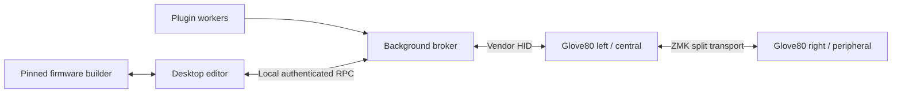

# Architecture

## Components

### Firmware

The firmware extension exposes an **indicator surface**:

- stable cell topology and capabilities;
- an explicit control mode;
- key-down and key-up events while that mode is active;
- atomic cell scenes;
- firmware-local animations;
- bounded brightness and power behavior; and
- lease-based ownership with fail-open recovery.

### Broker

The broker is the only process allowed to open the device:

- maintains the lease;
- dispatches gestures to plugins;
- subscribes to plugin state;
- resolves competing visuals;
- validates every scene against device capabilities; and
- continues running when the editor window is closed.

### Editor

The editor imports MoErgo layout metadata, displays the physical layout, and
edits host-side pages and bindings. Firmware compilation and flashing are
separate, explicit workflows.

### Plugins

Plugins never receive raw HID handles or flashing authority. They expose
actions and observable state through a versioned SDK.

## Transport

The first transport is a vendor-defined HID collection over USB. It is compact,
self-describing, supported by macOS without a custom kernel driver, and already
proven on the target hardware.

Bluetooth HID support is secondary. Report-descriptor caching, battery impact,
and live output-write behavior must be tested independently.

## Split keyboard

The left half is the host-facing central. Right-side key positions already
reach the central through ZMK. Right-side lighting should receive compact
semantic scene updates and render animations locally; it should not receive a
continuous raw framebuffer.

## Configuration ownership

| Data | Owner |
| --- | --- |
| Normal typing layout and ZMK behaviors | Imported keymap / firmware |
| Device cell topology and safety limits | Firmware |
| Plugin installation | Desktop application |
| Pages and key bindings | Desktop broker |
| Plugin state | Plugin |
| Resolved active scene | Broker and firmware lease |

This separation lets bindings change instantly without flash writes.
