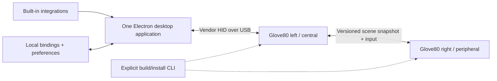

# Architecture

## Components

### Firmware

The firmware extension exposes a capability-described **control surface**:

- a fixed capability/status feature report;
- one leased, atomically committed scene over every available RGB cell;
- key-down and key-up events while that mode is active;
- solid and pulse; blink remains conditional on later accessibility and power
  evidence;
- bounded brightness and power behavior; and
- a momentary control layer gated by a live host session.

### Desktop application

One state-owning TypeScript runtime in Electron main initially owns all runtime
responsibilities:

- opens the HID device;
- runs built-in integrations;
- stores local bindings for every available cell;
- resolves semantic state into accessible presentations;
- refreshes the scene lease;
- dispatches control-layer events; and
- presents a small configuration UI and interaction HUD.

One coordinator is the logical state owner, while independent cancellable tasks
keep HID leases and integration observation responsive. A `SurfaceDevice`
adapter hides reports, sessions, fragmentation, and both-half acknowledgements
behind complete desired scenes. Desired and device-applied state remain
separate so the UI never claims a stale half is synchronized.

React renders the editor and HUD in Electron's sandboxed renderer. A narrow
preload bridge exposes only revisioned bootstrap state and validated semantic
commands. The renderer never receives Node.js, HID, arbitrary shell,
credential, or unrestricted filesystem access.

Electron main is authoritative. A browser-only simulator exists for fast
visual and accessibility testing because a normal browser has no preload
bridge. It is a visual harness, not a second product core: shared
command-sequence fixtures exercise the same complete-scene, split
acknowledgement, reset, expiry, churn, and interaction-freeze invariants
against both implementations.

These remain internal module boundaries, not services or a public SDK. A
daemon, authenticated local RPC, and worker isolation are added only if
measured lifecycle or security needs justify them. Electron's normal main,
renderer, and utility processes are an implementation detail; there is one
logical state owner and no separately installed helper.

The internal ports, visual keyboard editor, state flows, implementation
recommendation, and delivery phases are specified in
[Desktop application plan](application.md).

### Integrations

The first integrations are compiled into the application. They emit semantic
state snapshots and receive safe actions. Loading third-party code is deferred
until several different integrations have proven a stable contract and a
threat model exists.

The first real adapter is intentionally small. Electron main supervises one
user-installed `codex app-server` child over bounded stdio JSONL, validates a
small `thread/list` response subset, and feeds the existing task-board
allocator. No separate service, database, generic event bus, or plugin host is
introduced. Because another Codex process owns the live runtime, persisted
`notLoaded` tasks are represented as unknown rather than idle.

### Build and install

Firmware build/install is an explicit developer workflow, not part of the
runtime application. The first seam is a narrow generated include/overlay or a
documented keymap addition. Arbitrary keymap source rewriting is not assumed.

## Transport

The first transport is a vendor-defined HID collection over USB. Output and
feature reports have been proven for six cells; the required input report is
not yet proven.

Bluetooth HID support is secondary. Report-descriptor caching, battery impact,
and live output-write behavior must be tested independently.

## Split keyboard

The left half is the host-facing central. Right-side key positions already
reach the central through ZMK. The central owns the authoritative committed
scene, renders its local cells, and synchronizes the right-side subset to the
peripheral.

Right-side synchronization uses versioned complete snapshots, coalesces queued
updates to the newest generation, acknowledges the applied generation, and
resends the latest snapshot after reconnect. An incompatible or absent
peripheral disables only right-side rendering; it must not compromise typing
or the left side. Each half independently enforces its electrical budget.

## Configuration ownership

| Data | Owner |
| --- | --- |
| Normal typing layout and ZMK behaviors | User keymap / firmware build |
| Device cell topology and safety limits | Firmware |
| Ordered-cell bindings, allocation, and preferences | Desktop application |
| Integration state | Built-in integration |
| Resolved active scene | Application and firmware lease |

This separation lets bindings change instantly without flash writes.

## Evidence gates

Core 80-cell milestones still have safety gates; optional expansions have
product evidence gates:

| Expansion | Evidence required first |
| --- | --- |
| Public plugin SDK | Codex and Calendar shipped, then a concrete unresolved contract need |
| Separate daemon/UI | Proven lifecycle, privilege, or multi-client requirement |
| Core: full 40-cell left side | Measured total-current budget and chunked payload |
| Core: full 40-cell right side | Reconnect/resync, version mismatch, and independent-power tests |
| Bluetooth | Live input/output proof, cache behavior, and power measurement |
| Pages | Evidence that one 80-cell surface cannot remain understandable without them |
| Integrated firmware builder | A deterministic, validated keymap integration seam |
